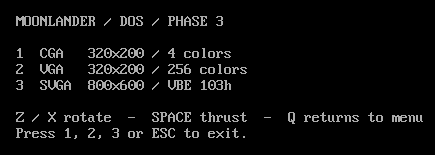
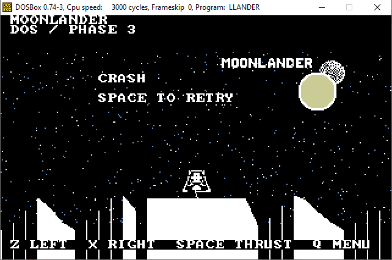

# A Lunar Lander for old DOS Laptops/PC - A Work in progress
| Game Menu | Screenshot |
| --- | --- |
|  |  |


# Moonlander for DOSBox

Phase 1 draws a stationary lunar lander and rotates it with held `Z` (left) and `X` (right). `Q` returns to the graphics-mode menu; `Esc` exits. Thrust, landing, and terrain are planned for later phases in [requirements.md](requirements.md).

## Build and run

Requires Python 3 with Pillow (`python -m pip install pillow`), Open Watcom 2 C for Windows, and DOSBox. From this directory:

```powershell
powershell -NoProfile -ExecutionPolicy Bypass -File .\build.ps1 -Watcom C:\path\to\watcom -Run
```

After building, double-click `run_dosbox.bat` to launch `LLander.exe` in DOSBox. The launcher mounts this folder as drive `C:`. It uses the DOSBox path configured in the batch file by default; set the `DOSBOX_EXE` environment variable to override it, or add `DOSBox.exe` to `PATH`.

`-Watcom` defaults to the `WATCOM` environment variable, then `C:\temp\lunar-dos-tools`; `-Run` uses `C:\Projects\RetroComputers\Emulators\DOSbox\DOSBox.exe` by default, or supply `-Dosbox`. The build makes `LLander.exe`, `LANDOFF.DAT`, and `LANDON.DAT`. All three must be in the same mounted DOS directory. To start manually:

```dos
MOUNT C C:\path\to\LunarLanderDOS
C:
LLANDER
```

Choose `1` for CGA 320x200 4-color, `2` for VGA 320x200 256-color, or `3` for VBE SVGA 800x600 256-color (mode 103h). For SVGA, set `machine=svga_s3` in DOSBox's `[dosbox]` configuration. A missing mode returns to the text menu. The scene uses logical 320x200 pixels; SVGA scales it 2x, centered with 80-pixel side margins and 100-pixel top/bottom margins.

## Replacing the artwork

`98.png` is the flame-off sprite sheet; `99.png` is flame-on. Both are 280x48 pixels with the seven original angle crops at their original positions. Replace either PNG with the same-size colored version and rebuild, or run:

```powershell
python convert_sprites.py --off new-off.png --on new-on.png --output .
```

Pillow converts each sheet to 28 mirrored, pivot-aligned frames, keeping the crop size for each frame. The anchor is the center pixel `(12,12)` of cell `(1,1)` in every source crop; its coordinates are mirrored with the frame so the craft rotates around a fixed point. DOS reads `LANDOFF.DAT` in Phase 1; `LANDON.DAT` is ready for Phase 2. Each file contains `LLS1`, a byte count (28), then for each frame four bytes (width, height, pivot X, pivot Y) and `width * height` one-byte color indices. Zero is transparent; indices 1..216 are a 6x6x6 RGB palette. VGA/SVGA use the palette directly; CGA maps to the nearest available colors.

An RGBA sheet uses its alpha channel for transparency, so opaque black details stay visible. On the original sheets without alpha, black is treated as transparent. Use `--black-transparent` to also remove black on an RGBA sheet. PNG files and Python are not needed inside DOSBox.


